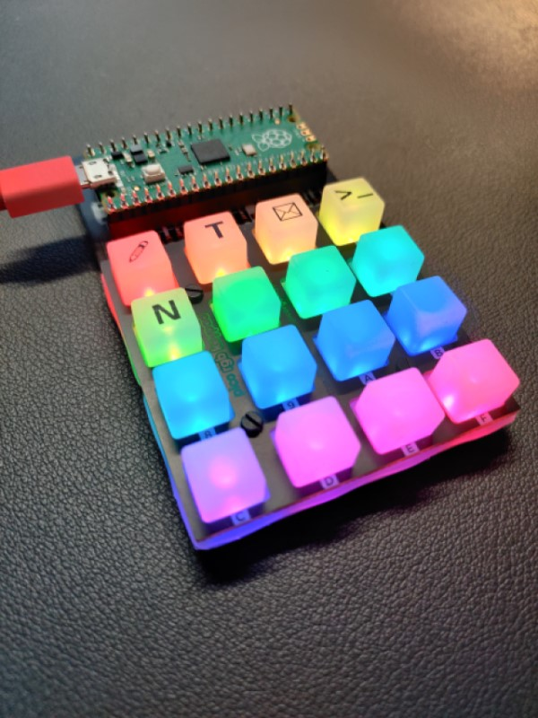

# Raspberry Pi Pico Macro Pad
A DIY macro pad utilising a Raspberry Pi Pico and the Pico RGB Keypad Base from Pimoroni

## Background
I picked up a Raspberry Pi Pico not long after they were released but, apart from trying out a few simple MicroPython scripts, it's been gathering dust in a drawer for the last few months while I was working on other things. That all changed however when I came across a couple of posts that mentioned combining the Pico with the [Pico RGB Keypad Base](https://shop.pimoroni.com/products/pico-rgb-keypad-base) from Pimoroni to create a mini macro keyboard.

I'm always looking for ways to improve my efficiency and so a dedicated device to quickly write out lengthy commands that I need to repeat with a press of a button really appealed. When set up with the correct libraries the keypad can mimic a full keyboard, allowing you to automate anything you can type, including tasks that would be difficult achieve without delving into something like Power Automate (e.g. copying data from an open window, switching applications and then pasting it).

With my InfoSec hat on, the keypad also has the potential to be used as a kind of [Rubber Ducky](https://hak5.org/products/usb-rubber-ducky-deluxe) device, capable of delivering multiple payloads onto a device with a few button presses.

## Instructions
N.B. At the time of writing the MicroPython firmware provided for the Pico RGB Keypad Base by Pimoroni doesn't support using it as a USB HID so I used Adafruit's CircuitPython, which does provide HID (keyboard) support.

1. Flash the Pico with a .UF2 file containing the latest stable build of [CircuitPython](https://circuitpython.org/board/raspberry_pi_pico/).
2. Download the [latest release](https://github.com/adafruit/Adafruit_CircuitPython_Bundle/releases/latest) of the CircuitPython bundle files. There are a lot of files in the bundle but we'll only need a couple of the folders.
  * Create a lib/ directory on your Pico
  * Copy all lib/adafruit_hid folder to CIRCUITPY/lib/
  * Copy the lib/adafruit_dotstar.py file to CIRCUITPY/lib/adafruit_dotstar.py
3. In Thonny, create a new file like `code.py` and save it to the Pico (CIRCUITPY)
4. Edit the code to your own needs. Each saved edit will cause the Pico to restart and run the updated code.

https://forums.pimoroni.com/t/pico-rgb-keypad-base-as-a-usb-hid-device-solved/16224/7

## Thanks
Thanks to:
* [wildestpixel](https://github.com/wildestpixel) for creating [this Gist](https://gist.github.com/wildestpixel/6b684b8bc886392f7c4c57015fab3d97) which I used as the basis for the code used in this project.
* ColinD on [this thread](https://forums.pimoroni.com/t/pico-rgb-keypad-base-as-a-usb-hid-device-solved/16224/7) on the Pimoroni support forums for the steer to use CircuitPython instead of MicroPython.
* qbalsdon for documenting their own Pico RGB Keypad project in [this repo](https://github.com/qbalsdon/pico_rgb_keypad_hid), although for the time being it's more complicated than what I wanted to achieve and contains some extra code that you don't need for a basic 16-key macro pad.

## To Do
- [ ] 3D print a case - https://www.thingiverse.com/thing:4761251
- [ ] Write payloads to use the macro pad for security testing
